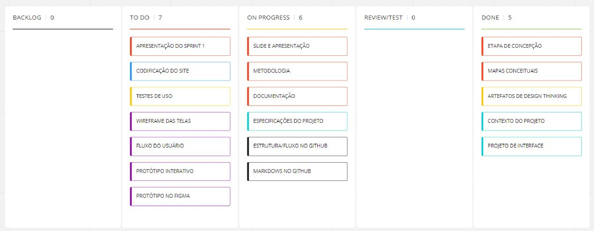
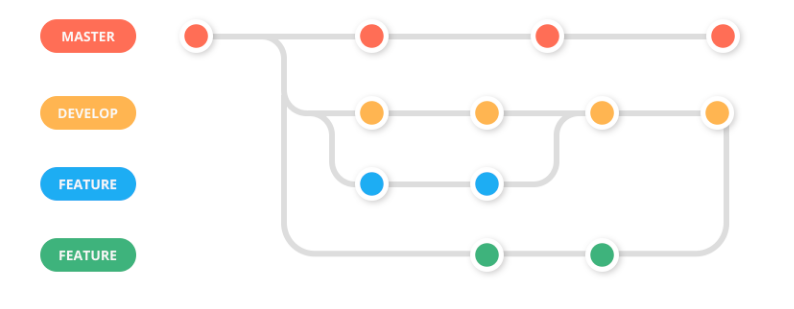

# Metodologia

## Gerenciamento do Projeto 
A equipe utiliza de métodologias ágeis, tendo o scrum como principal, para o gerenciamento do projeto. Assim, organizamos nossas tarefas em sprints de tempos determinados, nas quais realizamos nossas tarefas.

> A divisão de tarefas é feita no Kanban

  

## Gestão de Código Fonte
Para a gestão do código do projeto, a equipe utiliza o método baseado no Git Feature Workflow with Develop Branch.

> Dessa forma, evita-se o conflito entre os códigos do projeto principal e as features que estão sendo implementadas separadamente. Além disso, é criado um ambiente de desenvolvimento para testes de implementações futuras, sem interferir no projeto principal.

 

### Repositório 

> A equipe optou pelo uso do GitHub para o versionamento do código do projeto 

### Organização das branches

> A branch principal é a master, nela, estará contida a versão final para o cliente

Dessa Forma, a organização das branches se dá por:

- **Branch master** - Branch principal que contém o código final 
- **Branch develop** - Branch responsável pelo ambiente de desenvolvimento do projeto
- **Branch `feature`** - Branch responsável pelo desenvolvimento de uma `feature` específica 
